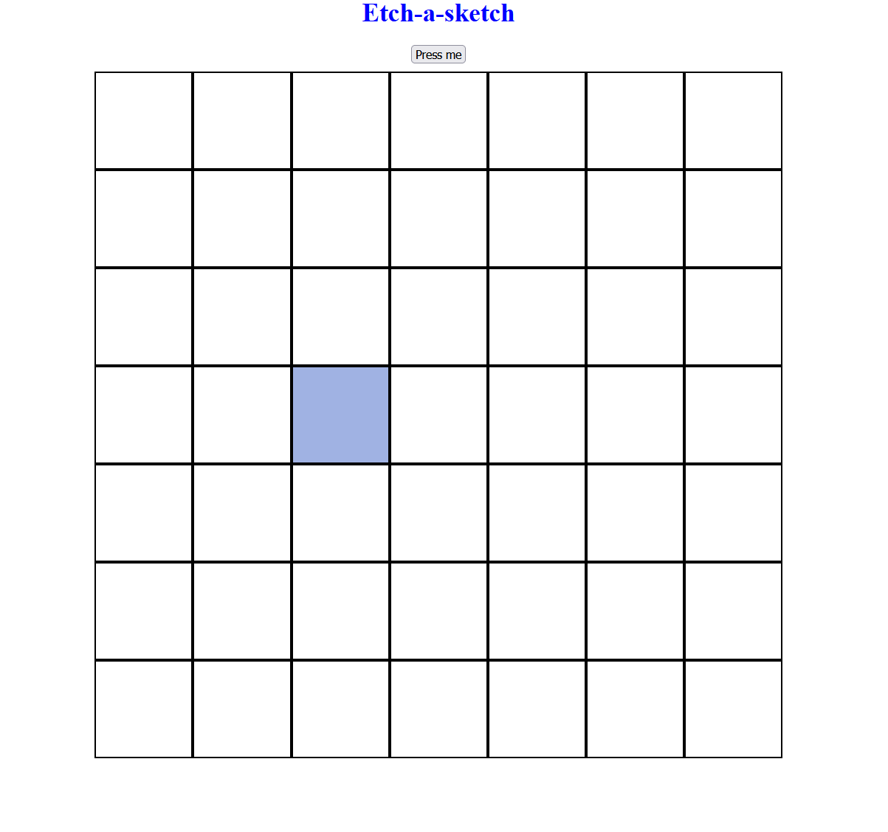

# Etch-a-sketch

This project uses HTML, CSS and Javascript to create an Etch-A-Sketch. The project aims to practice DOM manipulation skills.

## The Odin Project: Lesson Etch-A-Sketch

This project is build according to the specification of the [Etch-A-Sketch lesson](https://www.theodinproject.com/lessons/foundations-etch-a-sketch)

## Live website

Click the button to create a new grid of squares.

You will be asked to enter a number which will generate the amount of squares per side for the new grid.

Access the [Etch-A-Sketch](https://gohan61.github.io/Etch-a-sketch2/)

